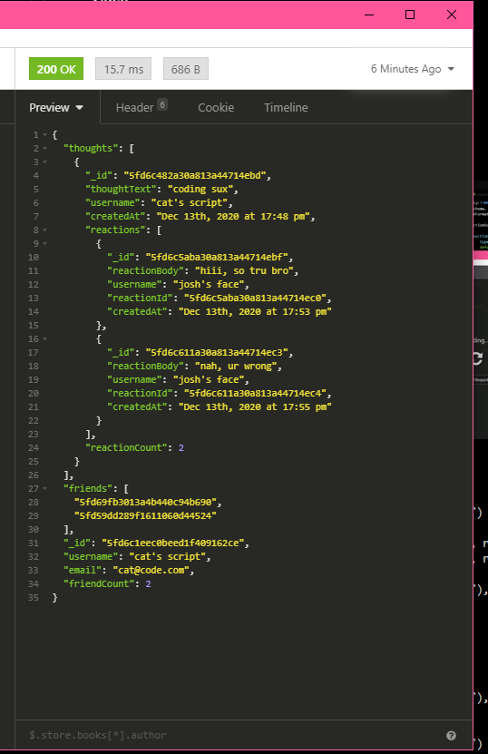

___
# Social Media API

## Description

This was an experiment in familiarizing myself with the [mongoose](https://www.npmjs.com/package/mongoose) and [mongodb](https://www.mongodb.com/1) way of doing CRUD operations and building out the humble beginnings of a social media website API.

HTTP requests for Users, Friends(User), Thoughts, Reactions(Thoughts).

I tested with [Insomnia](https://insomnia.rest/). 

_**Other:** All timestamps have been formatted using the supplied library from Pizza Hunt._

**Packages Used:**

* [express](https://www.npmjs.com/package/express)
* [mongoose](https://www.npmjs.com/package/mongoose)


## Table of Contents 

* [License](#license)
* [Installation](#installation)
* [Usage](#usage)
* [Video](#video)
* [Screenshot](#screenshot)


[](https://opensource.org/licenses/MIT)
<!-- this has clickability and will go to the legalese -->

## Installation 

First star it. 
Then you could either fork it or download a zip file of it.

```npm i``` will allow you to run it with all it's node package modules.

## Usage

**All of the details for npm shortcuts are stored in the package.json**

```npm start``` will run the application.

## Main Contributor

Code written by:

### Cat Lin (Caitlin) Morgan 

[GitHub](https://github.com/cat-lin-morgan/) - plummorgan@gmail.com

## Screenshot and Video

### Video

Here are the Social Media API tutorial videos!:

* [PART ONE - Testing the User](https://drive.google.com/file/d/1Tb-RKIcPUnjAiqB9rW9IwHwLyq01XIaU/view "Social Media API PART 1")
 
* [PART TWO - Testing the Thoughts](https://drive.google.com/file/d/1lwHk0zQjqkGzjcKKT7fZrixn5Qviwy8A/view "Social Media API PART 2")
 
* [PART THREE - Testing the Friends and Reactions](https://drive.google.com/file/d/1I-FZz5VuTyq1hjJU517jSES_tjY_6JXz/view "Social Media API PART 3") 

### Screenshot

Below is a gif of testing the User model with Insomnia.

 




___Thank you___

___
